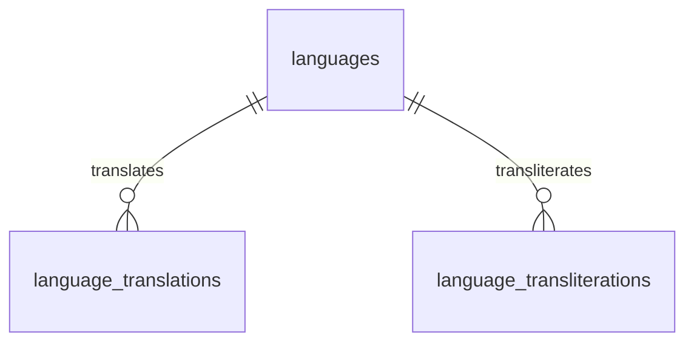

# Language Schema

The **Language Schema** is the core multilingual foundation of the BookQubit database. It provides a centralized and normalized way to manage languages, translations, transliterations, locales, scripts, and language-related metadata used throughout the platform.

This schema is designed to support internationalization (i18n), localization (l10n), multilingual content management, and future global expansion.

---

# Purpose

The Language Schema enables the BookQubit platform to:

* Manage supported languages.
* Store standardized language metadata.
* Support language translations.
* Support language transliterations (romanization).
* Support multiple writing systems.
* Support Left-to-Right (LTR) and Right-to-Left (RTL) languages.
* Provide a reusable language registry for all database modules.

---

# Directory Structure

```text
01_language_schema/
│
├── docs/
│   ├── README.md
│   ├── language_model.md
│   ├── schema_overview.md
│   ├── transliteration_vs_translation.md
│   ├── iso_language_codes.md
│   └── examples.md
│
├── tables/
│   ├── languages.sql
│   ├── language_translations.sql
│   └── language_transliterations.sql
│
├── indexes/
│   ├── languages.indexes.sql
│   ├── language_translations.indexes.sql
│   └── language_transliterations.indexes.sql
│
├── triggers/
│   ├── languages_updated_at.sql
│   ├── language_translations_updated_at.sql
│   └── language_transliterations_updated_at.sql
│
├── views/
│
├── seeds/
│   ├── languages.seed.sql
│   ├── language_translations.seed.sql
│   └── language_transliterations.seed.sql
│
└── migrations/
```

---

# Schema Components

| Component                   | Description                                      |
| --------------------------- | ------------------------------------------------ |
| `languages`                 | Master registry of all supported languages       |
| `language_translations`     | Stores translated language names                 |
| `language_transliterations` | Stores transliterated (romanized) language names |

---

# Database Relationships



---

# Features

* Normalized database design
* Unicode support
* ISO language codes
* Locale support
* Script support
* Translation support
* Transliteration support
* LTR / RTL support
* Foreign key integrity
* Extensible architecture
* Production-ready structure

---

# Supported Standards

| Standard  | Purpose                     |
| --------- | --------------------------- |
| ISO 639-1 | Two-letter language codes   |
| ISO 639-3 | Three-letter language codes |
| ISO 15924 | Script identifiers          |
| BCP 47    | Locale identifiers          |
| Unicode   | Character encoding          |
| CLDR      | Localization data           |

---

# Example Languages

| Code | Locale | Name     | Native Name | Script     | Direction |
| ---- | ------ | -------- | ----------- | ---------- | --------- |
| en   | en-US  | English  | English     | Latin      | LTR       |
| hi   | hi-IN  | Hindi    | हिन्दी      | Devanagari | LTR       |
| ar   | ar-SA  | Arabic   | العربية     | Arabic     | RTL       |
| ja   | ja-JP  | Japanese | 日本語         | Kanji/Kana | LTR       |
| ta   | ta-IN  | Tamil    | தமிழ்       | Tamil      | LTR       |

---

# Translation vs Transliteration

| Translation      | Transliteration        |
| ---------------- | ---------------------- |
| Converts meaning | Converts pronunciation |
| 日本語 → Japanese   | 日本語 → Nihongo          |
| Deutsch → German | Deutsch → Deutsch      |
| العربية → Arabic | العربية → Al-Arabiyyah |

---

# Usage Across BookQubit

This schema is intended to be referenced by multiple modules, including:

* Books
* Comics
* Authors
* Publishers
* Categories
* Geography
* User Profiles
* Search
* SEO
* User Interface Localization
* APIs

---

# Design Principles

* Normalize data to reduce duplication.
* Store each language only once.
* Keep translations separate from transliterations.
* Use foreign keys for referential integrity.
* Follow international standards.
* Store all text as Unicode.
* Build for scalability and future language additions.

---

# Documentation

| Document                            | Description                            |
| ----------------------------------- | -------------------------------------- |
| `language_model.md`                 | Detailed data model and relationships  |
| `schema_overview.md`                | High-level schema architecture         |
| `transliteration_vs_translation.md` | Explanation and examples               |
| `iso_language_codes.md`             | Supported language codes and standards |
| `examples.md`                       | Sample data and SQL usage examples     |

---

# Future Enhancements

Planned extensions include:

* Language families
* Regional language variants
* Locale-specific formatting
* Date and time localization
* Currency formatting
* Number formatting
* Pluralization rules
* Text collation rules
* Font preferences
* Spell-check metadata
* Search normalization
* Transliteration standards

---

# Related Schemas

The Language Schema serves as a shared dependency for other core schemas.

```text
Language Schema
        │
        ├── Book Schema
        ├── Author Schema
        ├── Publisher Schema
        ├── Geography Schema
        ├── Category Schema
        ├── Comic Schema
        ├── User Schema
        └── Search Schema
```

---

# License

This schema is part of the **BookQubit Database Project** and is intended to provide a reusable, scalable, and standards-compliant multilingual foundation for all database modules.
