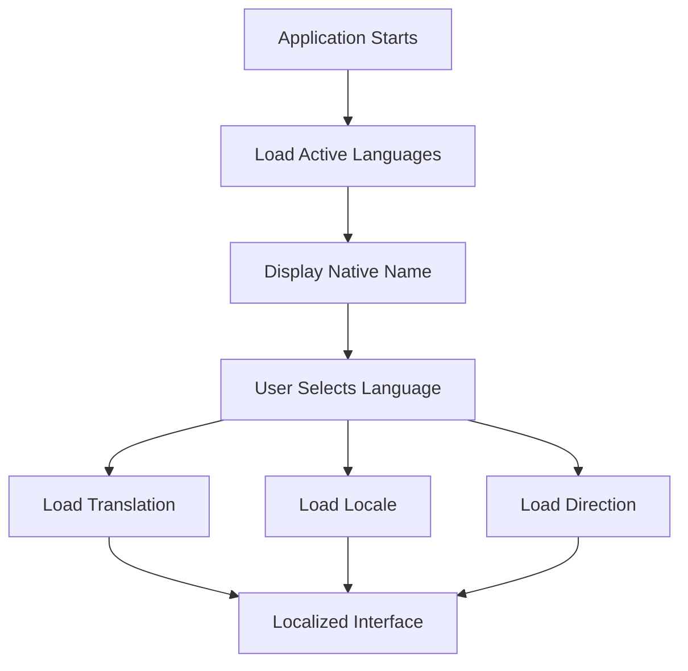
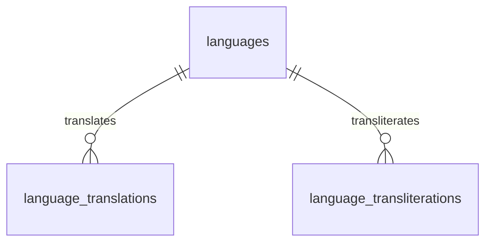
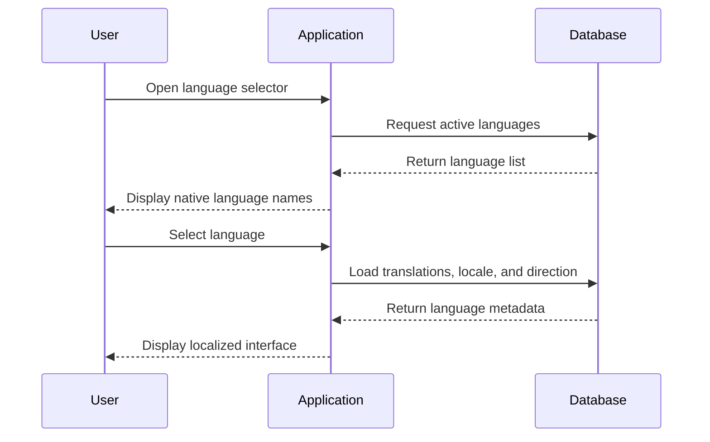

# Language Schema Examples

## Overview

This document contains practical examples demonstrating how the **BookQubit Language Schema** can be used. It includes sample records, SQL queries, translations, transliterations, and common use cases.

The examples are based on the following core tables:

* `languages`
* `language_translations`
* `language_transliterations`

---

# Example 1: Supported Languages

## languages

| id | code | locale | name     | native_name | script | direction | enabled |
| -: | ---- | ------ | -------- | ----------- | ------ | --------- | :-----: |
|  1 | en   | en-US  | English  | English     | Latn   | LTR       |    ✓    |
|  2 | hi   | hi-IN  | Hindi    | हिन्दी      | Deva   | LTR       |    ✓    |
|  3 | ja   | ja-JP  | Japanese | 日本語         | Jpan   | LTR       |    ✓    |
|  4 | ar   | ar-SA  | Arabic   | العربية     | Arab   | RTL       |    ✓    |
|  5 | ta   | ta-IN  | Tamil    | தமிழ்       | Taml   | LTR       |    ✓    |

---

# Example 2: Language Translations

## language_translations

| language_id | translation_language_id | translated_name |
| ----------- | ----------------------- | --------------- |
| 2           | 1                       | Hindi           |
| 3           | 1                       | Japanese        |
| 4           | 1                       | Arabic          |
| 5           | 1                       | Tamil           |
| 1           | 2                       | अंग्रेज़ी       |
| 3           | 2                       | जापानी          |
| 4           | 2                       | अरबी            |

---

# Example 3: Language Transliterations

## language_transliterations

| language_id | transliteration_language_id | transliterated_name |
| ----------- | --------------------------- | ------------------- |
| 2           | 1                           | Hindi               |
| 3           | 1                           | Nihongo             |
| 4           | 1                           | Al-Arabiyyah        |
| 5           | 1                           | Tamil               |
| 1           | 2                           | इंग्लिश             |

---

# Example 4: Translation vs Transliteration

| Original | Translation | Transliteration |
| -------- | ----------- | --------------- |
| हिन्दी   | Hindi       | Hindi           |
| 日本語      | Japanese    | Nihongo         |
| العربية  | Arabic      | Al-Arabiyyah    |
| Deutsch  | German      | Deutsch         |
| 中文       | Chinese     | Zhōngwén        |

---

# Example 5: Insert a New Language

```sql
INSERT INTO languages (
    code,
    locale,
    name,
    native_name,
    script,
    direction
)
VALUES (
    'ko',
    'ko-KR',
    'Korean',
    '한국어',
    'Hang',
    'LTR'
);
```

---

# Example 6: Insert a Translation

```sql
INSERT INTO language_translations (
    language_id,
    translation_language_id,
    translated_name
)
VALUES (
    3,
    1,
    'Japanese'
);
```

---

# Example 7: Insert a Transliteration

```sql
INSERT INTO language_transliterations (
    language_id,
    transliteration_language_id,
    transliterated_name
)
VALUES (
    3,
    1,
    'Nihongo'
);
```

---

# Example 8: Get All Supported Languages

```sql
SELECT
    id,
    code,
    locale,
    name,
    native_name,
    script,
    direction
FROM languages
ORDER BY name;
```

Example result:

| code | name     | native_name |
| ---- | -------- | ----------- |
| ar   | Arabic   | العربية     |
| en   | English  | English     |
| hi   | Hindi    | हिन्दी      |
| ja   | Japanese | 日本語         |
| ta   | Tamil    | தமிழ்       |

---

# Example 9: Get English Translation of Every Language

```sql
SELECT
    l.native_name,
    t.translated_name
FROM language_translations t
JOIN languages l
    ON l.id = t.language_id
WHERE t.translation_language_id = (
    SELECT id
    FROM languages
    WHERE code = 'en'
);
```

Example result:

| Native Name | English Translation |
| ----------- | ------------------- |
| हिन्दी      | Hindi               |
| 日本語         | Japanese            |
| العربية     | Arabic              |
| தமிழ்       | Tamil               |

---

# Example 10: Get English Transliteration

```sql
SELECT
    l.native_name,
    tr.transliterated_name
FROM language_transliterations tr
JOIN languages l
    ON l.id = tr.language_id
WHERE tr.transliteration_language_id = (
    SELECT id
    FROM languages
    WHERE code = 'en'
);
```

Example result:

| Native Name | Transliteration |
| ----------- | --------------- |
| हिन्दी      | Hindi           |
| 日本語         | Nihongo         |
| العربية     | Al-Arabiyyah    |
| தமிழ்       | Tamil           |

---

# Example 11: Search by Language Code

```sql
SELECT *
FROM languages
WHERE code = 'hi';
```

Result:

| code | locale | native_name |
| ---- | ------ | ----------- |
| hi   | hi-IN  | हिन्दी      |

---

# Example 12: Active Languages

```sql
SELECT
    code,
    name
FROM languages
WHERE enabled = TRUE
ORDER BY name;
```

---

# Example 13: Right-to-Left Languages

```sql
SELECT
    code,
    native_name
FROM languages
WHERE direction = 'RTL';
```

Example result:

| Code | Language |
| ---- | -------- |
| ar   | العربية  |
| ur   | اردو     |
| he   | עברית    |

---

# Example 14: Languages Using the Devanagari Script

```sql
SELECT
    code,
    native_name
FROM languages
WHERE script = 'Deva';
```

Example result:

| Code | Language |
| ---- | -------- |
| hi   | हिन्दी   |
| mr   | मराठी    |
| ne   | नेपाली   |

---

# Example 15: Languages by Locale

```sql
SELECT
    code,
    locale
FROM languages
ORDER BY locale;
```

---

# Example 16: Language Selector



---

# Example 17: Database Relationships



---

# Example 18: Book Metadata

Suppose a book is written in Japanese.

## books

|  id | title   | language_id |
| --: | ------- | ----------: |
| 101 | 吾輩は猫である |           3 |

Retrieve the language information:

```sql
SELECT
    b.title,
    l.name,
    l.native_name,
    l.locale
FROM books b
JOIN languages l
    ON l.id = b.language_id;
```

Example result:

| Title   | Language | Native Name | Locale |
| ------- | -------- | ----------- | ------ |
| 吾輩は猫である | Japanese | 日本語         | ja-JP  |

---

# Example 19: Language Selection Workflow



---

# Example 20: Best Practices

## Do

* Store one row per language.
* Use ISO 639 language codes.
* Use BCP 47 locale identifiers.
* Store ISO 15924 script codes.
* Keep translations separate from transliterations.
* Enable foreign key constraints.
* Store multilingual text as Unicode.

## Don't

* Store translated names in the `languages` table.
* Mix translations and transliterations in one column.
* Duplicate language metadata across multiple tables.
* Hard-code language names in application logic.
* Use language names as primary identifiers instead of standardized codes.

---

# Summary

These examples demonstrate how the Language Schema can be used to:

* Register supported languages.
* Store standardized language metadata.
* Manage translations and transliterations independently.
* Build language selectors.
* Support multilingual user interfaces.
* Enable search and SEO.
* Reference languages from other schemas such as Books, Authors, Comics, Geography, and User Profiles.

Following these patterns will help keep the BookQubit database consistent, normalized, scalable, and aligned with international standards.
