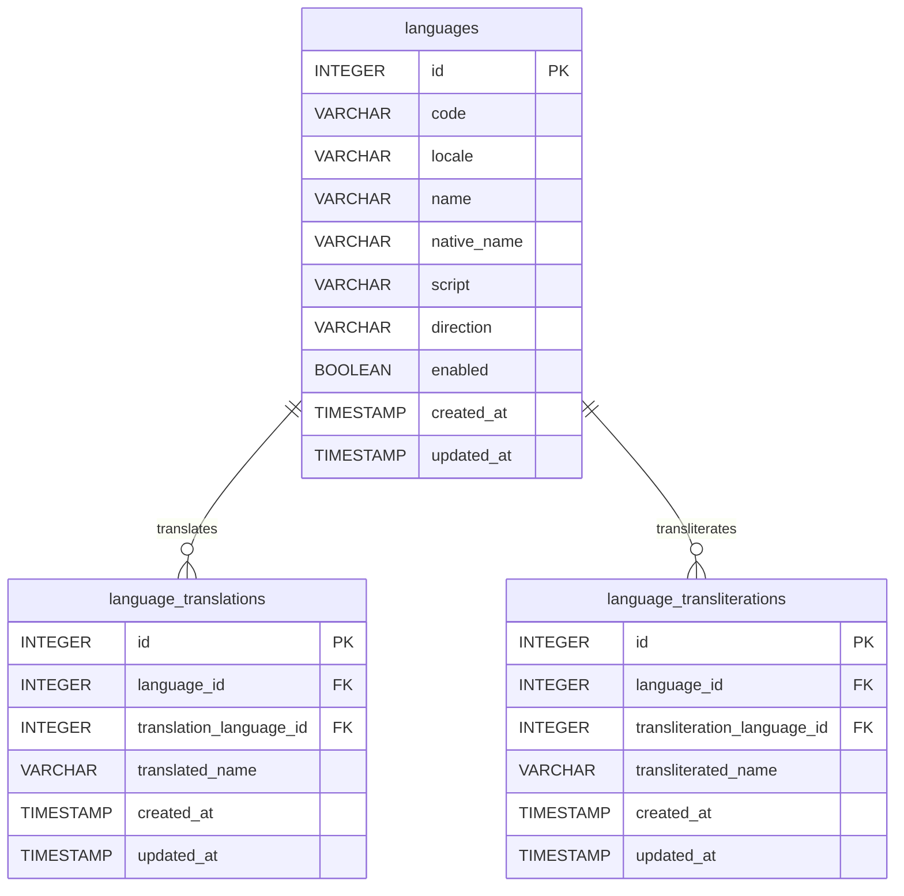
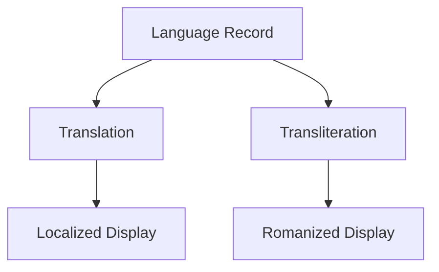

# Language Schema Model

## Overview

The Language Schema provides a centralized, normalized, and extensible foundation for multilingual support across the BookQubit platform.

This schema is responsible for:

* Managing supported languages.
* Managing language metadata.
* Supporting language translations.
* Supporting language transliterations (romanization).
* Providing locale information.
* Supporting left-to-right (LTR) and right-to-left (RTL) languages.
* Enabling future internationalization (i18n) and localization (l10n) features.

The schema is designed to support:

* Books
* Comics
* Authors
* Geography
* Categories
* Tags
* User Interface Localization
* Search and SEO

---

# Standards

The schema follows industry standards where possible.

| Standard  | Purpose                     |
| --------- | --------------------------- |
| ISO 639-1 | Two-letter language codes   |
| ISO 639-3 | Three-letter language codes |
| ISO 15924 | Script codes                |
| BCP 47    | Locale identifiers          |
| Unicode   | Character encoding          |
| CLDR      | Localization data           |

---

# Core Tables

| Table                     | Purpose                                          |
| ------------------------- | ------------------------------------------------ |
| languages                 | Master language registry                         |
| language_translations     | Language names translated into other languages   |
| language_transliterations | Language names transliterated into other scripts |

---

# Entity Relationship Diagram



---

# Table: languages

## Purpose

Stores all supported languages.

## Columns

| Column      | Type         | Description           |
| ----------- | ------------ | --------------------- |
| id          | INTEGER      | Primary key           |
| code        | VARCHAR(10)  | ISO language code     |
| locale      | VARCHAR(20)  | Locale code           |
| name        | VARCHAR(100) | English language name |
| native_name | VARCHAR(100) | Native language name  |
| script      | VARCHAR(50)  | Writing system        |
| direction   | VARCHAR(3)   | LTR or RTL            |
| enabled     | BOOLEAN      | Language availability |
| created_at  | TIMESTAMP    | Creation timestamp    |
| updated_at  | TIMESTAMP    | Last update timestamp |

---

## Example Records

| code | locale | name     | native_name | script     | direction |
| ---- | ------ | -------- | ----------- | ---------- | --------- |
| en   | en-US  | English  | English     | Latin      | LTR       |
| hi   | hi-IN  | Hindi    | हिन्दी      | Devanagari | LTR       |
| ar   | ar-SA  | Arabic   | العربية     | Arabic     | RTL       |
| ja   | ja-JP  | Japanese | 日本語         | Kanji/Kana | LTR       |

---

# Table: language_translations

## Purpose

Stores translated language names.

A translation represents the meaning of a language name in another language.

---

## Example

| Language | Translation Language | Result    |
| -------- | -------------------- | --------- |
| हिन्दी   | English              | Hindi     |
| 日本語      | English              | Japanese  |
| English  | Hindi                | अंग्रेज़ी |

---

## Columns

| Column                  | Type         |
| ----------------------- | ------------ |
| id                      | INTEGER      |
| language_id             | INTEGER FK   |
| translation_language_id | INTEGER FK   |
| translated_name         | VARCHAR(150) |
| created_at              | TIMESTAMP    |
| updated_at              | TIMESTAMP    |

---

## Example Data

| language_id | translation_language_id | translated_name |
| ----------- | ----------------------- | --------------- |
| Hindi       | English                 | Hindi           |
| Japanese    | English                 | Japanese        |
| English     | Hindi                   | अंग्रेज़ी       |

---

# Table: language_transliterations

## Purpose

Stores transliterated language names.

A transliteration preserves pronunciation rather than meaning.

---

## Example

| Original | Transliteration |
| -------- | --------------- |
| हिन्दी   | Hindi           |
| 日本語      | Nihongo         |
| தமிழ்    | Tamil           |
| العربية  | Al-Arabiyyah    |

---

## Columns

| Column                      | Type         |
| --------------------------- | ------------ |
| id                          | INTEGER      |
| language_id                 | INTEGER FK   |
| transliteration_language_id | INTEGER FK   |
| transliterated_name         | VARCHAR(150) |
| created_at                  | TIMESTAMP    |
| updated_at                  | TIMESTAMP    |

---

# Translation vs Transliteration

## Translation

Translation converts meaning.

Example:

| Original | Translation |
| -------- | ----------- |
| 日本語      | Japanese    |
| Deutsch  | German      |
| Español  | Spanish     |

---

## Transliteration

Transliteration converts pronunciation.

Example:

| Original | Transliteration |
| -------- | --------------- |
| 日本語      | Nihongo         |
| हिन्दी   | Hindi           |
| العربية  | Al-Arabiyyah    |

---

## Comparison

| Language | Native  | Translation | Transliteration |
| -------- | ------- | ----------- | --------------- |
| Hindi    | हिन्दी  | Hindi       | Hindi           |
| Japanese | 日本語     | Japanese    | Nihongo         |
| German   | Deutsch | German      | Deutsch         |
| Arabic   | العربية | Arabic      | Al-Arabiyyah    |

---

# Supported Scripts

Examples of scripts that may be stored in the schema.

| Script     | Example  |
| ---------- | -------- |
| Latin      | English  |
| Devanagari | Hindi    |
| Arabic     | Arabic   |
| Cyrillic   | Russian  |
| Han        | Chinese  |
| Kana       | Japanese |
| Hangul     | Korean   |
| Tamil      | Tamil    |
| Bengali    | Bengali  |
| Gujarati   | Gujarati |

---

# Direction Support

## Left-To-Right

```text
English
Hindi
French
Japanese
```

Direction value:

```text
LTR
```

---

## Right-To-Left

```text
Arabic
Urdu
Persian
Hebrew
```

Direction value:

```text
RTL
```

---

# Constraints

## languages

```sql
UNIQUE(code)
UNIQUE(locale)
CHECK(direction IN ('LTR','RTL'))
```

---

## language_translations

```sql
UNIQUE(language_id, translation_language_id)
CHECK(language_id <> translation_language_id)
```

---

## language_transliterations

```sql
UNIQUE(language_id, transliteration_language_id)
CHECK(language_id <> transliteration_language_id)
```

---

# Recommended Indexes

```sql
idx_languages_code
idx_languages_locale
idx_languages_enabled

idx_language_translations_language
idx_language_translations_target

idx_language_transliterations_language
idx_language_transliterations_target
```

---

# Future Enhancements

The schema can be extended with:

* Language aliases
* Regional variants
* Language families
* Locale preferences
* Number formatting
* Date formatting
* Currency formatting
* Time formatting
* Sorting rules (collations)
* Pluralization rules
* Search normalization
* Romanization standards
* Font recommendations

---

# Best Practices

* Use ISO language codes.
* Use locale identifiers where appropriate.
* Keep translations and transliterations separate.
* Never duplicate language records.
* Use foreign keys for referential integrity.
* Keep language metadata centralized.
* Prefer Unicode throughout the system.
* Use locale-aware formatting for user-facing content.

---

# Example Workflow



---

# Summary

The Language Schema serves as the authoritative source for language metadata within BookQubit. It supports multilingual content, localization, internationalization, search optimization, and future global expansion while maintaining a normalized and scalable database design.
