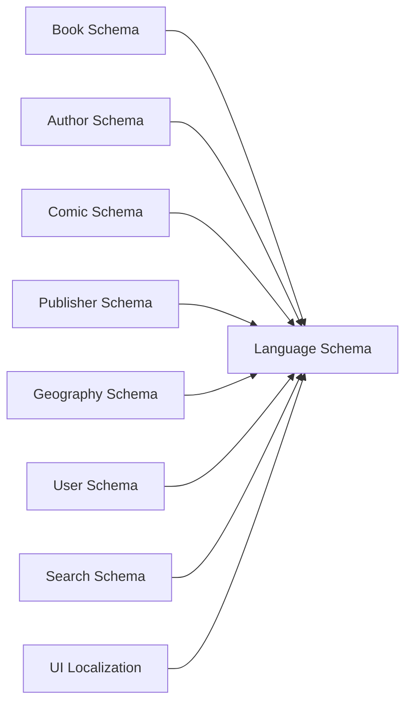
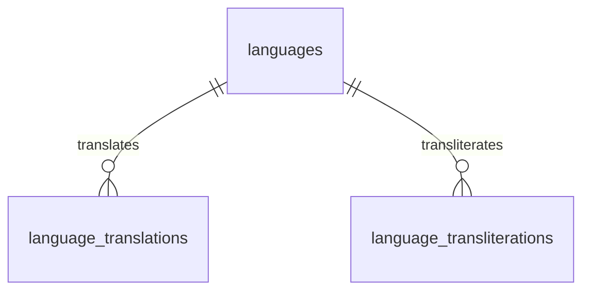
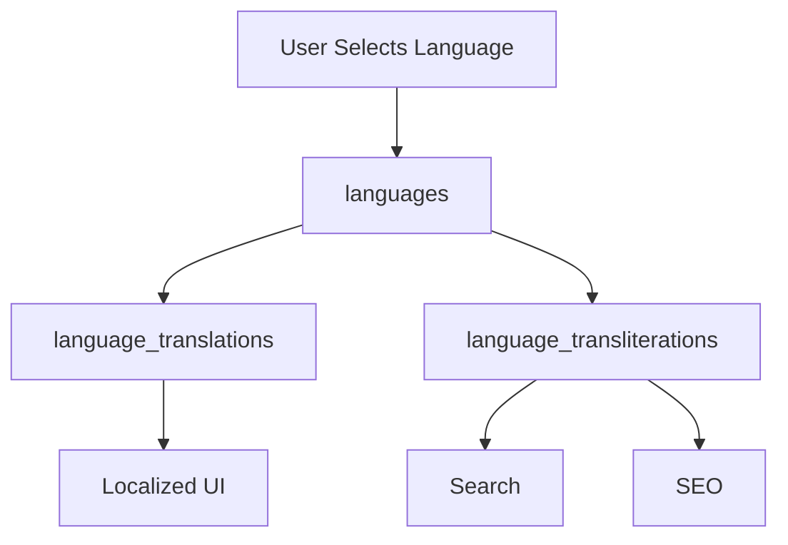

# Language Schema Overview

## Overview

The **Language Schema** is a core component of the BookQubit database architecture. It provides a centralized repository for language-related information that can be shared across all application modules.

Rather than storing language names, locales, or scripts repeatedly in multiple tables, the schema maintains a single authoritative source of truth. Other schemas reference this data using foreign keys, ensuring consistency, reducing duplication, and simplifying maintenance.

---

# Objectives

The Language Schema is designed to:

* Centralize language information.
* Support multilingual content.
* Enable internationalization (i18n).
* Enable localization (l10n).
* Support translation and transliteration.
* Support multiple writing systems.
* Maintain referential integrity.
* Scale to hundreds of languages and locales.

---

# Architecture



The Language Schema acts as a shared dependency used throughout the database.

---

# Schema Components

The schema consists of three primary tables.

| Table                         | Purpose                                           |
| ----------------------------- | ------------------------------------------------- |
| **languages**                 | Stores supported languages and their metadata.    |
| **language_translations**     | Stores translated language names.                 |
| **language_transliterations** | Stores transliterated (romanized) language names. |

---

# Entity Relationship Diagram



---

# Table Responsibilities

## languages

The master language registry.

Stores:

* Language code
* Locale
* Native language name
* English name
* Script
* Writing direction
* Active status

Example:

| Code | Name     | Native Name |
| ---- | -------- | ----------- |
| en   | English  | English     |
| hi   | Hindi    | हिन्दी      |
| ja   | Japanese | 日本語         |
| ar   | Arabic   | العربية     |

---

## language_translations

Stores translated names of languages.

Example:

| Language | Translation Language | Result    |
| -------- | -------------------- | --------- |
| हिन्दी   | English              | Hindi     |
| 日本語      | English              | Japanese  |
| English  | Hindi                | अंग्रेज़ी |

Purpose:

* User interfaces
* Language selectors
* Multilingual displays

---

## language_transliterations

Stores phonetic representations of language names.

Example:

| Original | Transliteration |
| -------- | --------------- |
| हिन्दी   | Hindi           |
| 日本語      | Nihongo         |
| العربية  | Al-Arabiyyah    |

Purpose:

* Romanized search
* SEO-friendly URLs
* Search indexing
* Pronunciation guidance

---

# Translation vs Transliteration

These concepts are intentionally separated.

| Translation      | Transliteration        |
| ---------------- | ---------------------- |
| Converts meaning | Converts pronunciation |
| 日本語 → Japanese   | 日本語 → Nihongo          |
| Deutsch → German | Deutsch → Deutsch      |
| العربية → Arabic | العربية → Al-Arabiyyah |

---

# Data Flow



---

# Standards

The schema follows internationally recognized standards.

| Standard  | Description                 |
| --------- | --------------------------- |
| ISO 639-1 | Two-letter language codes   |
| ISO 639-3 | Three-letter language codes |
| ISO 15924 | Script codes                |
| BCP 47    | Locale identifiers          |
| Unicode   | Character encoding          |
| CLDR      | Localization data           |

---

# Supported Writing Systems

Examples include:

* Latin
* Devanagari
* Arabic
* Cyrillic
* Han
* Kana
* Hangul
* Tamil
* Bengali
* Gujarati
* Gurmukhi
* Hebrew
* Thai
* Georgian

The design allows additional scripts to be added without schema changes.

---

# Writing Direction

The schema supports:

| Direction | Description   |
| --------- | ------------- |
| LTR       | Left-to-Right |
| RTL       | Right-to-Left |

Examples:

| Language | Direction |
| -------- | --------- |
| English  | LTR       |
| Hindi    | LTR       |
| Japanese | LTR       |
| Arabic   | RTL       |
| Urdu     | RTL       |
| Hebrew   | RTL       |

---

# Relationships with Other Schemas

```text
Book Schema
       │
Comic Schema
       │
Author Schema
       │
Publisher Schema
       │
Geography Schema
       │
User Schema
       │
Category Schema
       │
Search Schema
       │
       ▼
Language Schema
```

The Language Schema should be referenced by all modules requiring language information instead of duplicating language data.

---

# Design Principles

The schema follows these principles:

* Single source of truth
* Data normalization
* Referential integrity
* Standards compliance
* Scalability
* Extensibility
* Unicode-first design
* Clear separation of responsibilities
* Future-proof architecture

---

# Benefits

Using a centralized Language Schema provides:

* Consistent language metadata.
* Reduced data duplication.
* Easier maintenance.
* Simplified localization.
* Better search capabilities.
* Improved SEO support.
* Cleaner database design.
* Easier addition of new languages.
* Reliable multilingual support.

---

# Future Roadmap

Potential enhancements include:

* Language families
* Regional dialects
* Locale preferences
* Currency formatting
* Date and time formatting
* Number formatting
* Pluralization rules
* Collation and sorting rules
* Font recommendations
* Spell-check metadata
* Hyphenation rules
* Search normalization
* Full CLDR integration

---

# Summary

The Language Schema provides the multilingual foundation for BookQubit. By centralizing language metadata, translations, and transliterations, it enables consistent internationalization across all modules while remaining scalable, normalized, and aligned with industry standards.
