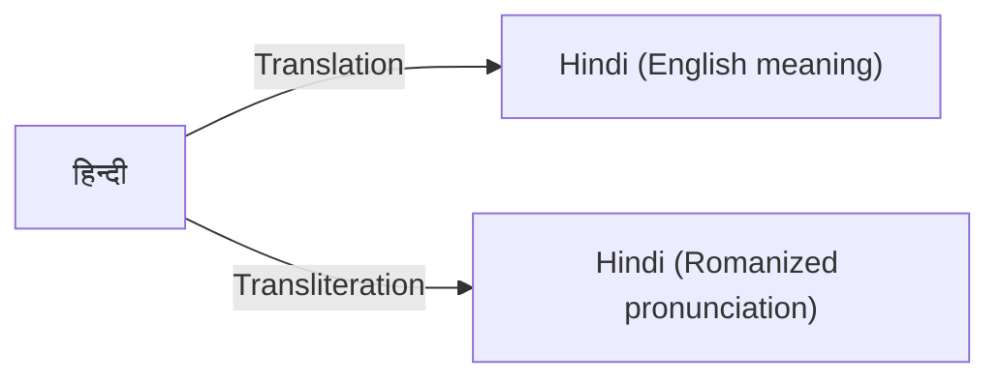
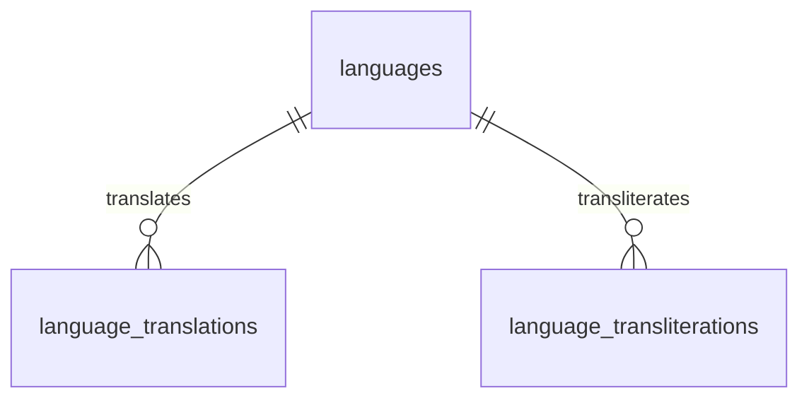

# Transliteration vs Translation

## Overview

Although **transliteration** and **translation** are often confused, they serve two very different purposes in multilingual systems.

Understanding this distinction is essential when designing databases, search systems, APIs, and user interfaces for international applications such as **BookQubit**.

---

# Definitions

## Translation

**Translation** converts the **meaning** of text from one language into another.

The translated text conveys the same idea or meaning but may use completely different words.

### Example

| Original | Language | Translation | Target Language |
| -------- | -------- | ----------- | --------------- |
| 日本語      | Japanese | Japanese    | English         |
| Deutsch  | German   | German      | English         |
| Español  | Spanish  | Spanish     | English         |
| العربية  | Arabic   | Arabic      | English         |

Translation answers the question:

> **"What does this word mean in another language?"**

---

## Transliteration

**Transliteration** converts the **pronunciation** of text from one writing system into another.

It attempts to preserve how a word sounds, not what it means.

### Example

| Original | Language | Transliteration |
| -------- | -------- | --------------- |
| हिन्दी   | Hindi    | Hindi           |
| 日本語      | Japanese | Nihongo         |
| العربية  | Arabic   | Al-Arabiyyah    |
| தமிழ்    | Tamil    | Tamil           |

Transliteration answers the question:

> **"How do I pronounce this word using another script?"**

---

# Quick Comparison

| Feature                 | Translation               | Transliteration                     |
| ----------------------- | ------------------------- | ----------------------------------- |
| Converts                | Meaning                   | Pronunciation                       |
| Changes language        | Yes                       | No                                  |
| Changes script          | Usually                   | Yes                                 |
| Preserves pronunciation | Not necessarily           | Yes                                 |
| Preserves meaning       | Yes                       | No                                  |
| Used for                | Reading and understanding | Search, pronunciation, romanization |

---

# Visual Comparison



---

# Examples

## Hindi

| Type            | Result |
| --------------- | ------ |
| Original        | हिन्दी |
| Translation     | Hindi  |
| Transliteration | Hindi  |

---

## Japanese

| Type            | Result   |
| --------------- | -------- |
| Original        | 日本語      |
| Translation     | Japanese |
| Transliteration | Nihongo  |

---

## Arabic

| Type            | Result       |
| --------------- | ------------ |
| Original        | العربية      |
| Translation     | Arabic       |
| Transliteration | Al-Arabiyyah |

---

## German

| Type            | Result  |
| --------------- | ------- |
| Original        | Deutsch |
| Translation     | German  |
| Transliteration | Deutsch |

---

## Russian

| Type            | Result  |
| --------------- | ------- |
| Original        | Русский |
| Translation     | Russian |
| Transliteration | Russkiy |

---

## Korean

| Type            | Result   |
| --------------- | -------- |
| Original        | 한국어      |
| Translation     | Korean   |
| Transliteration | Hangugeo |

---

## Chinese (Simplified)

| Type            | Result   |
| --------------- | -------- |
| Original        | 中文       |
| Translation     | Chinese  |
| Transliteration | Zhōngwén |

---

# Why Both Are Needed

Modern multilingual applications require both translation and transliteration.

## Translation is used for

* User interfaces
* Documentation
* Book metadata
* Category names
* API responses
* Localized content
* Language selectors

Example:

```text
日本語
↓

Japanese
```

---

## Transliteration is used for

* Search engines
* Romanized URLs
* SEO
* Pronunciation guides
* Voice assistants
* Keyboard input
* Slugs
* Search indexing

Example:

```text
日本語
↓

Nihongo
```

---

# Database Design

The BookQubit database stores translations and transliterations separately.



This separation avoids mixing two different concepts in a single table.

---

# Example Data

## languages

| id | code | native_name |
| -- | ---- | ----------- |
| 1  | en   | English     |
| 2  | hi   | हिन्दी      |
| 3  | ja   | 日本語         |
| 4  | ar   | العربية     |

---

## language_translations

| language_id | translation_language_id | translated_name |
| ----------- | ----------------------- | --------------- |
| 2           | 1                       | Hindi           |
| 3           | 1                       | Japanese        |
| 4           | 1                       | Arabic          |
| 1           | 2                       | अंग्रेज़ी       |

---

## language_transliterations

| language_id | transliteration_language_id | transliterated_name |
| ----------- | --------------------------- | ------------------- |
| 2           | 1                           | Hindi               |
| 3           | 1                           | Nihongo             |
| 4           | 1                           | Al-Arabiyyah        |
| 1           | 2                           | इंग्लिश             |

---

# Common Use Cases

| Use Case             | Translation | Transliteration |
| -------------------- | ----------- | --------------- |
| Display localized UI | ✓           | ✗               |
| Pronunciation guide  | ✗           | ✓               |
| Search indexing      | ✗           | ✓               |
| SEO-friendly URLs    | ✗           | ✓               |
| Language selector    | ✓           | ✓               |
| Book metadata        | ✓           | ✓               |
| API responses        | ✓           | Optional        |
| Romanized filenames  | ✗           | ✓               |

---

# Common Mistakes

## Mixing Translation and Transliteration

Incorrect:

```text
日本語
↓

Japanese
```

Stored as a transliteration.

This is incorrect because **Japanese** is the English translation, not the pronunciation.

---

Correct:

| Type            | Value    |
| --------------- | -------- |
| Translation     | Japanese |
| Transliteration | Nihongo  |

---

## Storing Both in One Column

Avoid storing values like:

| language_name      |
| ------------------ |
| Japanese / Nihongo |

This makes searching, indexing, sorting, and localization more difficult.

Use separate tables instead.

---

# Best Practices

* Keep translations and transliterations in separate tables.
* Follow Unicode standards for all text.
* Use recognized romanization systems where available (e.g., Hepburn for Japanese, ISO standards for many languages, Pinyin for Chinese).
* Preserve native names in the `languages` table.
* Use translations for display to users.
* Use transliterations for search, pronunciation, and SEO.
* Enforce referential integrity with foreign keys.
* Avoid duplicating language metadata.

---

# Summary

| Translation           | Transliteration                        |
| --------------------- | -------------------------------------- |
| Preserves meaning     | Preserves pronunciation                |
| Used for localization | Used for romanization                  |
| Changes language      | Changes writing system                 |
| Improves readability  | Improves searchability                 |
| Used in UI            | Used in search, SEO, and pronunciation |

---

## Conclusion

Translation and transliteration solve different problems. A well-designed multilingual database stores them independently, allowing applications to present localized content while also supporting search, pronunciation, indexing, and international usability.

The BookQubit Language Schema adopts this approach by providing dedicated tables for **language translations** and **language transliterations**, ensuring a scalable, normalized, and standards-based multilingual foundation.
