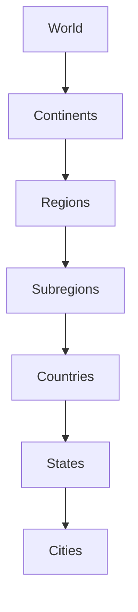
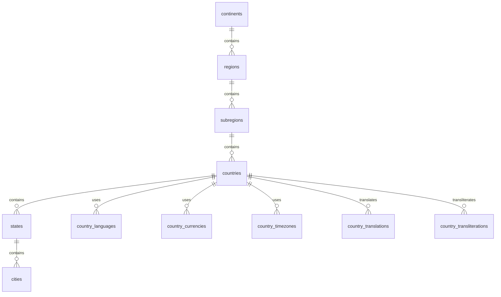

# Geography Schema

## Overview

The **Geography Schema** is a core reference schema within the BookQubit database. It provides standardized geographic information used throughout the platform, including continents, regions, countries, states or provinces, cities, time zones, currencies, postal codes, and multilingual geographic names.

The schema is designed to be reusable by all modules that require geographic or location-based data. Rather than duplicating country or city information in multiple tables, other schemas reference this data using foreign keys, ensuring consistency, referential integrity, and easier maintenance.

---

# Purpose

The Geography Schema enables the BookQubit platform to:

* Store standardized geographic reference data.
* Support multilingual country, state, and city names.
* Support international addresses.
* Manage currencies and time zones.
* Support country and regional metadata.
* Enable localization and internationalization.
* Provide reusable geographic data for all modules.

---

# Features

* Normalized database design
* Global geographic coverage
* Multilingual translations
* Transliterations (Romanization)
* ISO-compliant country and region codes
* Time zone support
* Currency support
* Phone calling codes
* Postal code support
* Geographic hierarchy
* Foreign key integrity
* Unicode support
* Extensible architecture

---

# Directory Structure

```text
02_geography_schema/
│
├── README.md
│
├── 01_tables/
├── 02_indexes/
├── 03_constraints/
├── 04_triggers/
├── 05_views/
├── 06_functions/
├── 07_procedures/
├── 08_seeds/
├── 09_migrations/
├── 10_queries/
├── 11_tests/
├── 12_examples/
└── 13_docs/
    ├── README.md
    ├── schema_overview.md
    ├── geography_model.md
    ├── country_codes.md
    ├── administrative_divisions.md
    ├── timezones.md
    ├── currencies.md
    ├── translations.md
    ├── examples.md
    ├── best_practices.md
    └── data_sources.md
```

---

# Geographic Hierarchy



---

# Core Tables

| Table                    | Description                      |
| ------------------------ | -------------------------------- |
| continents               | World continents                 |
| regions                  | Major geographic regions         |
| subregions               | Geographic subregions            |
| countries                | Countries and territories        |
| states                   | States, provinces, territories   |
| cities                   | Cities and municipalities        |
| currencies               | Currency definitions             |
| country_currencies       | Country-to-currency mapping      |
| timezones                | IANA time zones                  |
| country_timezones        | Country-to-timezone mapping      |
| country_languages        | Official and supported languages |
| phone_codes              | International dialing codes      |
| postal_codes             | Postal code metadata             |
| country_flags            | Flag metadata                    |
| country_translations     | Localized country names          |
| country_transliterations | Romanized country names          |

---

# Standards

The Geography Schema follows internationally recognized standards.

| Standard   | Purpose                    |
| ---------- | -------------------------- |
| ISO 3166-1 | Country codes              |
| ISO 3166-2 | State and province codes   |
| ISO 4217   | Currency codes             |
| ISO 639    | Language codes             |
| ISO 15924  | Script codes               |
| UN M49     | Geographic regions         |
| BCP 47     | Locale identifiers         |
| Unicode    | Character encoding         |
| CLDR       | Localized geographic names |
| IANA TZDB  | Time zone database         |

---

# Example Hierarchy

```text
World
└── Asia
    └── Southern Asia
        └── India
            ├── Madhya Pradesh
            │   ├── Bhopal
            │   ├── Indore
            │   └── Jabalpur
            │
            ├── Maharashtra
            │   ├── Mumbai
            │   └── Pune
            │
            └── Karnataka
                ├── Bengaluru
                └── Mysuru
```

---

# Relationships



---

# Integration with Other Schemas

The Geography Schema acts as a shared reference for multiple BookQubit modules.

```text
Books
Authors
Publishers
Users
Libraries
Orders
Payments
Warehouses
Shipping
Analytics
Search
Localization
        │
        ▼
Geography Schema
```

Typical examples include:

* Author nationality
* Publisher headquarters
* User address
* Shipping destination
* Book availability by country
* Tax calculation
* Regional pricing
* Localized content

---

# Documentation

| Document                      | Description                         |
| ----------------------------- | ----------------------------------- |
| `schema_overview.md`          | High-level architecture and design  |
| `geography_model.md`          | Database model and relationships    |
| `country_codes.md`            | ISO 3166 and related standards      |
| `administrative_divisions.md` | States, provinces, and territories  |
| `timezones.md`                | IANA time zone support              |
| `currencies.md`               | ISO 4217 currency information       |
| `translations.md`             | Localization and multilingual names |
| `examples.md`                 | SQL examples and sample data        |
| `best_practices.md`           | Design recommendations              |
| `data_sources.md`             | Reference datasets and standards    |

---

# Design Principles

The Geography Schema follows these principles:

* Single source of truth
* Data normalization
* Referential integrity
* Standards compliance
* Unicode-first storage
* Scalable architecture
* Separation of concerns
* Reusable reference data
* Extensible design

---

# Future Enhancements

The schema is designed to accommodate future additions without breaking compatibility, including:

* Geographic coordinates (latitude/longitude)
* Administrative levels beyond states
* Historic country data
* Alternative country names
* Regional economic zones
* Population statistics
* Climate regions
* Continually updated CLDR translations
* Geospatial indexing
* GIS integration

---

# Summary

The Geography Schema provides a centralized, standards-compliant repository for geographic information across the BookQubit platform. By combining international standards with a normalized relational design, it supports multilingual applications, international users, localization, reporting, and future global expansion while avoiding duplicated geographic data across the database.
